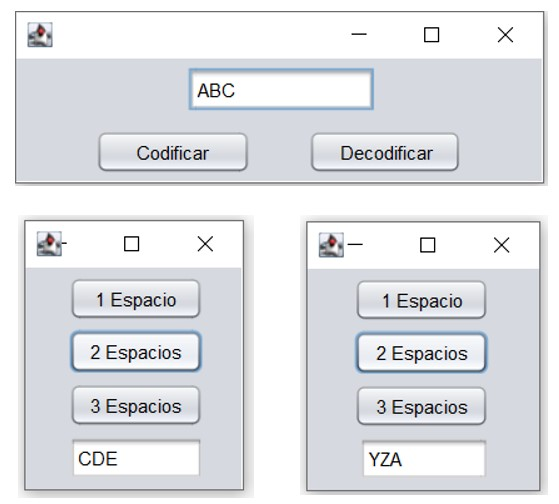

# CifradoCesar-CaesarCipher
Caesar Cipher Example with GUI

This is an example of the use of graphical interfaces, where a cesar cipher encoder and decoder are implemented, and where different options are available.

Both the encoding and decoding can be done for the jump between characters of one, two or three spaces.

